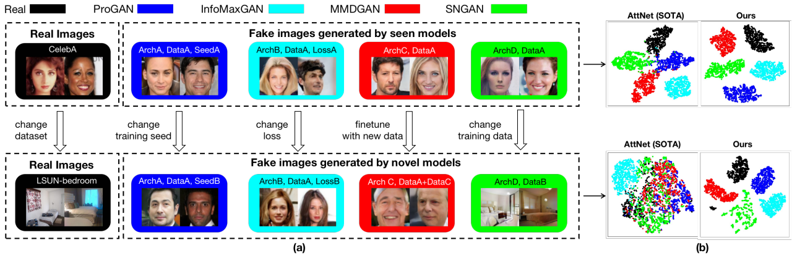

# DNA-Det

### Deepfake Network Architecture Attribution
Tianyun Yang, Ziyao Huang, Juan Cao, Lei Li, Xirong Li<br>
AAAI 2022 [Arxiv](https://arxiv.org/pdf/2202.13843.pdf)


- [Mar 3, 2022] **Note:** The resource links are placeholders for now, we will update them and open source code soon!
- [Mar 10, 2022] The source code, dataset and models are all released.

## Abstract
With the rapid progress of generation technology, it has become necessary to attribute the origin of fake images. Existing works on fake image attribution perform multi-class classification on several Generative Adversarial Network (GAN) models and obtain high accuracies. While encouraging, these works are restricted to model-level attribution, only capable of handling images generated by seen models with a specific seed, loss and dataset, which is limited in real-world scenarios.
In this work:<br>
- We present the first study on **Deepfake Network Architecture Attribution** to attribute fake images on **architecture-level**. <br>
- We develop a simple yet effective approach named DNA-Det to extract architecture traces, which adopts pre-training on image transformation classification and
patchwise contrastive learning to capture globally consistent features that are invariant to semantics. <br>
- The evaluations on multiple cross-test setups and a large-scale dataset verify the effectiveness of DNA-Det. DNA-Det maintains a significantly higher accuracy than existing methods in cross-seed, cross-loss, cross-finetune and cross-dataset settings.

## Prerequisites
- Linux
- NVIDIA GPU + CUDA 11.1
- Python 3.7.10
- pytorch 1.9.0
<!-- - To install the other Python dependencies, run `pip3 install -r requirements.txt`. -->

## Datasets
You can download the dataset from [Baiduyun(passwd:nlof)](https://pan.baidu.com/s/1nCfkyflsZs-ECz7LiUngTQ), the detailed information about this dataset are shown below.

| Resolution | Real, GAN | Content | Source |
|:-----------------:|:---------:|:----------:|:----------:|
| 128x128| Real | CelebA, LSUN-bedroom | [CelebA](https://mmlab.ie.cuhk.edu.hk/projects/CelebA.html), [LSUN](https://www.yf.io/p/lsun)|
| 128x128| ProGAN | CelebA, LSUN-bedroom | [GANFingerprint](https://github.com/ningyu1991/GANFingerprints)|
| 128x128| MMDGAN | CelebA, LSUN-bedroom | [GANFingerprint](https://github.com/ningyu1991/GANFingerprints)|
| 128x128| SNGAN | CelebA, LSUN-bedroom | [GANFingerprint](https://github.com/ningyu1991/GANFingerprints)|
| 128x128| CramerGAN | CelebA, LSUN-bedroom | [GANFingerprint](https://github.com/ningyu1991/GANFingerprints)|
| 128x128| InfoMaxGAN | CelebA, LSUN-bedroom |[mimicry](https://github.com/kwotsin/mimicry)|
| 128x128| SSGAN | CelebA, LSUN-bedroom |[mimicry](https://github.com/kwotsin/mimicry)|
| 256x256| Real | cat, airplane, boat, horse, sofa, cow, dog, train, bicycle, bottle, diningtable, motorbike, sheep, tvmonitor, bird, bus, chair, person, pottedplant, car | [CNNDetection](https://github.com/peterwang512/CNNDetection) |
| 256x256| ProGAN | cat, airplane, boat, horse, sofa, cow, dog, train, bicycle, bottle, diningtable, motorbike, sheep, tvmonitor, bird, bus, chair, person, pottedplant, car |[CNNDetection](https://github.com/peterwang512/CNNDetection) |
| 256x256| StackGAN2 |cat, church, bird, bedroom, dog | [StackGAN-v2](https://github.com/hanzhanggit/StackGAN-v2)|
| 256x256| CycleGAN |winter, orange apple, horse, summer, zebra | [CNNDetection](https://github.com/peterwang512/CNNDetection) |
| 256x256| StyleGAN2 | cat, church horse | [CNNDetection](https://github.com/peterwang512/CNNDetection) |
| 1024x1024| Real | FFHQ, CeleA-HQ|  [FFHQ](https://github.com/NVlabs/ffhq-dataset), [CeleA-HQ](https://mmlab.ie.cuhk.edu.hk/projects/CelebA.html) |
| 1024x1024| StyleGAN | FFHQ, celebA-HQ, Yellow, Model, Asian Star, kid, elder, adult, glass, male, female, smile | [StyleGAN](https://github.com/NVlabs/stylegan), [seeprettyface](https://github.com/a312863063/seeprettyface-dataset) |
| 1024x1024| StyleGAN2 | FFHQ, Yellow, Wanghong, Asian Star, kid | [StyleGAN2](https://github.com/NVlabs/stylegan2), [seeprettyface](https://github.com/a312863063/seeprettyface-dataset) | 

## Data preparation
- Download dataset, and put it into the directory `./dataset`.
- Download the train part of [CNNDetection](https://github.com/peterwang512/CNNDetection) dataset, and put it into the directory `./dataset`.
- Prepare annotation files for training, validation, closed-set testing and cross testings.
  - Prepare dataset for the _**celebA**_ experiment. 
  ```
  python generate_data_multiple_cross.py --mode celeba
  ```
  
  - Prepare dataset for the _**LSUN-bedroom**_ experiment.
  ```
  python generate_data_multiple_cross.py --mode lsun
  ```
  - Prepare dataset for the _**in the wild**_ experiment.
  ```
  python generate_data_in_the_wild.py --mode in_the_wild
  ```
  After generation, the folder should be like this:
  ```
  dataset
  ├── ${mode}_test
  │   └── annotations
  │       ├── ${mode}_test.txt
  │       ├── ${mode}_test_cross_seed.txt
  │       ├── ${mode}_test_cross_loss.txt
  │       ├── ${mode}_test_cross_finetune.txt
  │       └── ${mode}_test_cross_dataset.txt
  ├── ${mode}_train
  │   └── annotations
  │       └── ${mode}_train.txt
  └── ${mode}_val
      └── annotations
          └── ${mode}_val.txt
  ``
  where `{mode}_train.txt, {mode}_val.txt, {mode}_test.txt, {mode}_test_cross_*.txt` are the txt files for training, validation, closed-set testing and cross testing spilts. 
- **Quick implement**: We provide generated txt files, they can be downloaded from [Baiduyun(passwd:olci)](https://pan.baidu.com/s/1fzoe9fmxmFuCkDnt5azqTg).
Put them into the directory `./dataset`.

<!-- ## Empirical Study on GAN Fingerprint
- Prepare dataset for architecture classification.
- Prepare dataset for architecture classification.
- Prepare dataset for weight classification.
- Train on patches from a single position.
- Test on patches from all positions.<br>
Please refer to our paper and supp for more details. -->

## Pretrain on Image Transformations
  ```
  sh ./script/run_train_pretrain.sh
  ```
After training, the model and logs are saved in `./dataset/pretrain_train/models/pretrain_val/pretrain/run_${run_id}/`.

## Training 
1. Specify training configurations in `./configs/${config_name}.py` <br> 
2. Specify settings including config_name, data_path and so on in `./scipt/run_train.sh` and run:
  ```
  sh ./script/run_train.sh
  ```
  - Following is an example for _**celebA**_ experiment:
  ```
  data_path=./dataset/
  train_collection=celeba_train
  val_collection=celeba_val
  config_name=celeba
  run_id=1
  pretrain_model_path=./dataset/pretrain_train/models/model.pth
  python main.py  --data_path $data_path --train_collection $train_collection --val_collection $val_collection \
  --config_name $config_name --run_id $run_id \
  --pretrain_model_path $pretrain_model_path 
  ```
  where
  - `data_path`: The dataset path
  - `train_collection`: The training split directory
  - `val_collection`: The validation split directory
  - `config_name`: The config file
  - `run_id`: The running id for numbering this training
  - `pretrain_model_path`: The pretrain model on image transformation classification
  
  Similarly, for the _**LSUN-bedroom**_ experiment:
  ```
  data_path=./dataset/
  train_collection=lsun_train
  val_collection=lsun_val
  config_name=lsun
  run_id=1
  pretrain_model_path=./datasets/pretrain_train/models/pretrain_val/pretrain/run_0/model.pth
  python main.py  --data_path $data_path --train_collection $train_collection --val_collection $val_collection \
  --config_name $config_name --run_id $run_id \
  --pretrain_model_path $pretrain_model_path 
  ```
  For the _**in the wild**_ experiment:
  ```
  data_path=./dataset/
  train_collection=in_the_wild_train
  val_collection=in_the_wild_val
  config_name=in_the_wild
  run_id=1
  pretrain_model_path=./datasets/pretrain_train/models/pretrain_val/pretrain/run_0/model.pth
  python main.py  --data_path $data_path --train_collection $train_collection --val_collection $val_collection \
  --config_name $config_name --run_id $run_id \
  --pretrain_model_path $pretrain_model_path 
  ```
3. After training, the models and logs are saved in `./${data_path}/${train_collection}$/models/${val_collection}/${config_name}/run_${run_id}/`.

## Pre-trained models
We provide pre-trained models:
[Baiduyun(passwd:olci)](https://pan.baidu.com/s/1fzoe9fmxmFuCkDnt5azqTg)
They have been put into the right path along with the annotation files , see `model_path` in `./script/run_test.sh`.

## Inference 
To evaluate the trained model on multiple cross-test setups. Specify settings in `./scipt/run_test.sh` and run:
  ```
  sh ./script/run_test.sh
  ```
  - Following is an example for the _**celebA**_ experiment:
  ```
  config_name=celeba
  model_path=./dataset/celeba_train/models/celeba_val/celeba/run_0/model.pth
  python3 pred_eval.py --model_path $model_path --config_name $config_name \
  --test_data_paths \  
  ./dataset/celeba_test/annotations/celeba_test.txt \
  ./dataset/celeba_test/annotations/celeba_test_cross_seed.txt \
  ./dataset/celeba_test/annotations/celeba_test_cross_loss.txt \
  ./dataset/celeba_test/annotations/celeba_test_cross_finetune.txt \
  ./dataset/celeba_test/annotations/celeba_test_cross_dataset.txt  
  ```
  - Following is an example for the _**LSUN-bedroom**_ experiment:
  ```
  config_name=lsun
  model_path=./dataset/lsun_train/models/lsun_val/lsun/run_0/model.pth
  python3 pred_eval.py --model_path $model_path --config_name $config_name \
  --test_data_paths \  
  ./dataset/lsun_test/annotations/lsun_test.txt \
  ./dataset/lsun_test/annotations/lsun_test_cross_seed.txt \
  ./dataset/lsun_test/annotations/lsun_test_cross_loss.txt \
  ./dataset/lsun_test/annotations/lsun_test_cross_finetune.txt \
  ./dataset/lsun_test/annotations/lsun_test_cross_dataset.txt  
  ```
  - Following is an example for the _**in the wild**_ experiment:
  ```
  config_name=in_the_wild
  model_path=./dataset/in_the_wild_train/models/in_the_wild_val/in_the_wild/run_0/model.pth
  python3 pred_eval.py --model_path $model_path --config_name $config_name \
  --test_data_paths \  
  ./dataset/in_the_wild_test/annotations/in_the_wild_test.txt \
  ./dataset/in_the_wild_test/annotations/in_the_wild_test_cross_dataset.txt  
  ```
  After running, the result will be saved in `./${test_data_path}/pred/result.txt`


## Citation
If you find our model/method/dataset useful, please cite our work
```
@inproceedings{yang2022deepfake,
  title={Deepfake Network Architecture Attribution},
  author={Yang, Tianyun and Huang, Ziyao and Cao, Juan and Li, Lei and Li, Xirong},
  booktitle={Proceedings of the 36th AAAI Conference on Artificial Intelligence (AAAI 2022)},
  year={2022}
}
``` 

## Acknowledgement
This work was supported by the Project of Chinese Academy of Sciences (E141020), the Project of Institute of Computing Technology, Chinese Academy of Sciences (E161020), Zhejiang Provincial Key Research and Development Program of China (No. 2021C01164), and the National Natural Science Foundation of China (No. 62172420).

<!-- last update: Feb, 2022 <br>
Tianyun Yang <br>
yangtianyun19z At ict dot ac dot cn <br>
 -->


