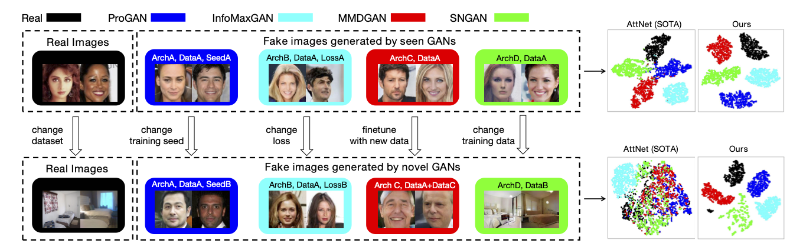

# DNA-Det
### Deepfake Network Architecture Attribution
Tianyun Yang, Ziyao Huang, Juan Cao, Lei Li, Xirong Li<br>
AAAI 2022


## Abstract
With the rapid progress of generation technology, it has become necessary to attribute the origin of fake images. Existing works on fake image attribution perform multi-class classification on several Generative Adversarial Network (GAN) models and obtain high accuracies. While encouraging, these works are restricted to model-level attribution, only capable of handling images generated by seen models with a specific seed, loss and dataset, which is limited in real-world scenarios.
In this work:<br>
- We present the first study on **Deepfake Network Architecture Attribution** to attribute fake images on **architecture-level**. <br>
- We develop a simple yet effective approach named DNA-Det to extract architecture traces, which adopts pre-training on image transformation classification and
patchwise contrastive learning to capture globally consistent features that are invariant to semantics. <br>
- The evaluations on multiple cross-test setups and a large-scale dataset verify the effectiveness of DNA-Det. DNA-Det maintains a significantly higher accuracy than existing methods in cross-seed, cross-loss, cross-finetune and cross-dataset settings.

## Prerequisites
- Linux
- NVIDIA GPU + CUDA 11.1
- Python 3.7.10
- pytorch 1.9.0
- To install the other Python dependencies, run `pip3 install -r requirements.txt`.

## Datasets
| Resolution | Real, GAN | Content | Source | Model, Data | 
|:-----------------:|:---------:|:----------:|:----------:|:----------:|
| 128x128| Real | CelebA, LSUN-bedroom | [CelebA](https://mmlab.ie.cuhk.edu.hk/projects/CelebA.html), [LSUN](https://www.yf.io/p/lsun) | Google drive, Baiduyun|
| 128x128| ProGAN | CelebA, LSUN-bedroom | [GANFingerprint](https://github.com/ningyu1991/GANFingerprints) | Google drive, Baiduyun|
| 128x128| MMDGAN | CelebA, LSUN-bedroom | [GANFingerprint](https://github.com/ningyu1991/GANFingerprints) | Google drive, Baiduyun|
| 128x128| SNGAN | CelebA, LSUN-bedroom | [GANFingerprint](https://github.com/ningyu1991/GANFingerprints) | Google drive, Baiduyun|
| 128x128| CramerGAN | CelebA, LSUN-bedroom | [GANFingerprint](https://github.com/ningyu1991/GANFingerprints) |Google drive, Baiduyun|
| 128x128| InfoMaxGAN | CelebA, LSUN-bedroom |[mimicry](https://github.com/kwotsin/mimicry)|Google drive, Baiduyun|
| 128x128| SSGAN | CelebA, LSUN-bedroom |[mimicry](https://github.com/kwotsin/mimicry)|Google drive, Baiduyun|
| 256x256| Real | cat, airplane, boat, horse, sofa, cow, dog, train, bicycle, bottle, diningtable, motorbike, sheep, tvmonitor, bird, bus, chair, person, pottedplant, car | [CNNDetection](https://github.com/peterwang512/CNNDetection) | Google drive, Baiduyun|
| 256x256| ProGAN | cat, airplane, boat, horse, sofa, cow, dog, train, bicycle, bottle, diningtable, motorbike, sheep, tvmonitor, bird, bus, chair, person, pottedplant, car |[CNNDetection](https://github.com/peterwang512/CNNDetection) |Google drive, Baiduyun|
| 256x256| StackGAN2 |cat, church, bird, bedroom, dog | [StackGAN-v2](https://github.com/hanzhanggit/StackGAN-v2)| Google drive, Baiduyun|
| 256x256| CycleGAN |winter, orange apple, horse, summer, zebra | [CNNDetection](https://github.com/peterwang512/CNNDetection) |Google drive, Baiduyun|
| 256x256| StyleGAN2 | cat, church horse | [CNNDetection](https://github.com/peterwang512/CNNDetection) | Google drive, Baiduyun|
| 1024x1024| Real | FFHQ, CeleA-HQ|  FFHQ, CeleA-HQ| Google drive, Baiduyun|
| 1024x1024| StyleGAN | celebA-HQ, Yellow, Model, Asian Star, kid, elder, adult, glass, male, female, smile | [StyleGAN](https://github.com/NVlabs/stylegan), [seeprettyface](https://github.com/a312863063/seeprettyface-dataset) | Google drive, Baiduyun|
| 1024x1024| StyleGAN2 | Yellow, Wanghong, Asian Star, kid | [StyleGAN2](https://github.com/NVlabs/stylegan2), [seeprettyface](https://github.com/a312863063/seeprettyface-dataset) |  Google drive, Baiduyun| 

## Data preparation
- Prepare dataset for evaluation on multiple cross-test setups
```
cd DataPrepare/
python generate_.py
```
- Prepare dataset for evaluation on gans in the wild
```
python generate_.py
```

## Empirical Study on GAN Fingerprint
- Prepare dataset for architecture classification.
- Prepare dataset for weight classification.
- Train on patches from a single position.
- Test on patches from all positions.<br>
Please refer to our paper and supp for more details.

## Training 
1. Specify training configurations in `./configs/${config_name}.py` <br> 
2. Specify settings including config_name, data_path and so on in `./scipt/run_train.sh` and run:
  ```
  sh ./script/run_train.sh
  ```
  - Following is an example for `run_train.sh`:
  ```
  data_path=./dataset/
  config_name=default
  run_id=0
  device=cuda:0
  train_collection=4GAN_128_celeba_train
  val_collection=4GAN_128_celeba_val
  python main.py  --data_path $data_path --train_collection $train_collection --val_collection $val_collection \
  --config_name $config_name --device $device --run_id $run_id
  ```
  where
  - `data_path`: The dataset path
  - `train_collection`: The training split 
  - `val_collection`: The validation split
  - `config_name`: The config file
  - `device`: The gpu device, e.g. cuda:0
  - `run_id`: The running id for numbering this training
## Pre-trained models


## Inference 
1. To evaluate the trained model on multiple cross-test setups.


2. To evalute the trained model on GANs in the wild.


3. To evalute the model's robustness against common post processings.


## Visualization

1. To viusalize the learned features using TSNE.


2. To visulize what regions the model relies on for decision using GradCAM.


## Citation
If you find our model/method/dataset useful, please cite our work
```

```

## Acknowledgement
This work was supported by the Project of Chinese Academy of Sciences (E141020), the Project of Institute of Computing Technology, Chinese Academy of Sciences (E161020), Zhejiang Provincial Key Research and Development Program of China (No. 2021C01164), and the National Natural Science Foundation of China (No. 62172420).


last update: December, 2021 <br>
Tianyun Yang <br>
yangtianyun19z At ict dot ac dot cn <br>


